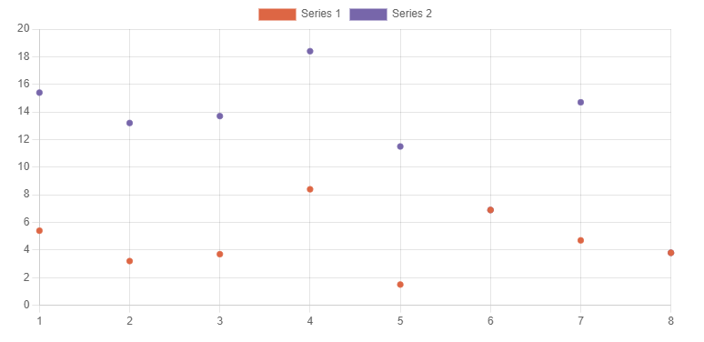

# ChartJS C++

ChartJS-Cpp is an Open Source, header-only C++ charting class.

## Introduction

ChartJS-Cpp provides a simple platform-independent C++ API for drawing different types of charts that outputs html files containing [ChartJS](https://www.chartjs.org/) javascript code.

It generates monolithic html files containing both the data and the ChartJS rendering code. The generated html files have no external dependencies which simplifies sharing and storage. They can be viewed in most modern browsers and can be opened both locally or from a server.

## Installation

ChartJS-Cpp is a single C++ header file and has no third-party library dependencies, so there is nothing to build. Just include `efernea/chartjs-cpp.hpp` in your source code.

The examples can be built with `cmake` (see CMakeLists.txt), but it is not required.

## API Documentation

Refer to the [ChartJS documentation](https://www.chartjs.org/docs/latest/) for a complete list of supported chart types and the available configuration options.

#### Constructor

Create a new html page that will contain the charts. If the file already exists, it will be overwritten.
~~~cpp
/**
* Create a new html page that will contain the charts. If the 
* file already exists, it will be overwritten.
*
* \param outputFile the output html file
* \param title the html page title
* \param width the page width in pixels or percentage (50%)
*/
ChartJsCpp(
    const char* outputFile,
    const char* title,
    const char* width)
~~~

#### Creating charts

Add a new chart to the page and specify the label values.
~~~cpp
/**
* Add a new chart to the page and specify the label values.
*
* \param name is the name of the chart. It must be unique.
* \param labels list of label values. 
*/
template<class T>
ChartJsCpp& Chart(
    const char* name,  
    const std::vector<T>& labels)
~~~

#### Adding datasets
Add a new dataset to the chart.
~~~cpp
/**
* Add a new dataset to the chart.
*
* \param label is the label of the dataset
* \param type the type of the series, "Line", "Bar", etc. See ChartJS 
*        for the complete list.
* \param color border and fill color
* \param data list of data values. The number of values must match 
*        the number of labels. For 'bubble' 
         chart types values are (x, y, r) triplets.
* \param multiColor generate colors for each value (bar, pie, etc)
* \param configuration ChartJS configuration string in json format.
*/
template<class T>
ChartJsCpp& DataSet(
    const char* label, // the label of the dataset
    const char* type, //"Line", "Bar", etc. See ChartJS for the complete list. 
    const char* color, // border and fill color
    const std::vector<T>& data, // list of data values
    bool multiColor = false,  // generate colors for each value (bar, pie, etc)
    const char* configuration = "") // ChartJS configuration string in json format.
~~~

#### Insert HTML content
Insert custom html content (like titles, descriptions, notes, etc.) before, between or after the charts.
~~~cpp
ChartJsCpp& Html(const char* html);
~~~

## Examples
~~~cpp
efernea::ChartJsCpp("chartjscpp_example.html", "60%")
    .Html("
")
    .Html("<h1>ChartJsExamples</h1>")
    .Html("<h2>Line</h2>")
    .Chart<int>("Line", {10,20,30,40,50,60,70,80})
        .DataSet<double>("Series 1", "line", "dd6644", {5.4,3.2,3.7,8.4,1.5,6.9,4.7,3.8})
        .DataSet<double>("Series 2", "line", "7766aa", {15.4,13.2,13.7,18.4,11.5,6.9,14.7,3.8}, "pointRadius: 0")
    .Html("<h2>Bar</h2>")
    .Chart<int>("Bar", {1,2,3,4,5,6,7,8})
        .DataSet<double>("Series 1", "bar", "dd6644", {5.4,3.2,3.7,8.4,1.5,6.9,4.7,3.8})
        .DataSet<double>("Series 2", "bar", "7766aa", {15.4,13.2,13.7,18.4,11.5,6.9,14.7,3.8})
    .Html("<h2>Radar</h2>")
    .Chart<int>("Radar", { 1,2,3,4,5,6,7,8 })
        .DataSet<double>("Series 1", "radar", "dd6644", { 5.4,3.2,3.7,8.4,1.5,6.9,4.7,3.8 })
        .DataSet<double>("Series 2", "radar", "7766aa", { 15.4,13.2,13.7,18.4,11.5,6.9,14.7,3.8 })
    .Html("<h2>Pie</h2>")
    .Chart<std::string>("Pies", { "a", "b", "c" })
        .DataSet<double>("Series 1", "pie", "dd6644", { 100, 10, 300 }, true)
    .Html("<h2>Polar area</h2>")
    .Chart<int>("Polar area", { 1,2,3,4,5,6,7,8 })
        .DataSet<double>("Series 1", "polarArea", "dd6644", { 5.4,3.2,3.7,8.4,1.5,6.9,4.7,3.8 })
        .DataSet<double>("Series 2", "polarArea", "7766aa", { 15.4,13.2,13.7,18.4,11.5,6.9,14.7,3.8 })
    .Html("<h2>Bubble</h2>")
    .Chart<int>("Bubble", { 1,2,3,4,5,6,7,8 })
        .DataSet<double>("Series 1", "bubble", "dd6644", { 5.4,3.2,23.7,8.4,1.5,26.9,4.7,3.8,19 })
        .DataSet<double>("Series 2", "bubble", "7766aa", { 15.4,13.2,53.7,18.4,11.5,6.9,14.7,3.8,62 })
    .Html("<h2>Scatter</h2>")
    .Chart<int>("Scatter", { 1,2,3,4,5,6,7,8 })
        .DataSet<double>("Series 1", "scatter", "dd6644", { 5.4,3.2,3.7,8.4,1.5,6.9,4.7,3.8 })
        .DataSet<double>("Series 2", "scatter", "7766aa", { 15.4,13.2,13.7,18.4,11.5,6.9,14.7,3.8 })
    .Html("<h2>Mixed</h2>")
    .Chart<int>("Mixed", {1,2,3,4,5,6,7,8})
        .DataSet<double>("Series 1", "line", "dd6644", {5.4,3.2,3.7,8.4,1.5,6.9,4.7,3.8}, false, "borderWidth: 3")
        .DataSet<double>("Series 2", "bar", "7766aa", {15.4,13.2,13.7,18.4,11.5,6.9,14.7,3.8}, false)
        ;
~~~

## Screenshots

## License
The class is licensed under the MIT License:

Copyright (c) 2019-2021 Eugen Fernea

Permission is hereby granted, free of charge, to any person obtaining a copy of this software and associated documentation files (the "Software"), to deal in the Software without restriction, including without limitation the rights to use, copy, modify, merge, publish, distribute, sublicense, and/or sell copies of the Software, and to permit persons to whom the Software is furnished to do so, subject to the following conditions:

The above copyright notice and this permission notice shall be included in all copies or substantial portions of the Software.

THE SOFTWARE IS PROVIDED "AS IS", WITHOUT WARRANTY OF ANY KIND, EXPRESS OR IMPLIED, INCLUDING BUT NOT LIMITED TO THE WARRANTIES OF MERCHANTABILITY, FITNESS FOR A PARTICULAR PURPOSE AND NONINFRINGEMENT. IN NO EVENT SHALL THE AUTHORS OR COPYRIGHT HOLDERS BE LIABLE FOR ANY CLAIM, DAMAGES OR OTHER LIABILITY, WHETHER IN AN ACTION OF CONTRACT, TORT OR OTHERWISE, ARISING FROM, OUT OF OR IN CONNECTION WITH THE SOFTWARE OR THE USE OR OTHER DEALINGS IN THE SOFTWARE.

---
The class uses the ChartJS javascript library which is licensed under the MIT License. Copyright (c) 2014-2021 Chart.js Contributors

